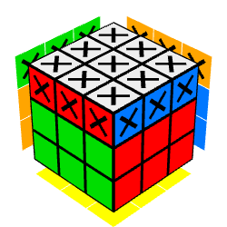
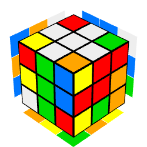

[Retour à l'index](../../readme.md)

## Résolution algorithmique du Rubik's Cube

_Cette documentation fait suite à celle sur la [résolution générale du Rubik's Cube](../solve/solve.md), il est important de l'avoir lue pour passer à la résolution algorithmique et la partie code._

## Sommaire

- [Objectifs de cette étape](#objectifs-de-cette-étape)
- [Principes généraux et méthodes](#principes-généraux-et-méthodes)
- [Résolution](#résolution)
- [Conclusion](#conclusion)

## Objectifs de cette étape

Cette étape consiste en la recherche d'une suite algorithmique de mouvements sur le Rubik's Cube menant à sa résolution systématique, à partir d'une configuration possible déterminée à partir d'un [dispositif de détection des couleurs](../color_detection/color_detection.md).

Il est crucial que les résultats obtenus soient valables dans 100% des cas, la suite de mouvement obtenue devra ensuite être exécutée par le robot et ses pinces mécaniques afin de résoudre le Rubik's Cube physiquement.

Le langage choisi pour la partie algorithmique est Java natif, les packages utilisés sont ceux de base (notamment ceux provenant de java.util).
Ce choix est une question d'affinité/simplicité, car l'approche relève plus de l'algorithmie brute que du code en lui-même, Java est seulement le support utilisé et pas une partie déterminante du code.

## Principes généraux et méthodes

**⚠ Il s'agit d'exemples de méthodes et non pas d'une liste exhaustive ⚠**

La structure du programme est définie comme tel:

- On part d'une représentation virtuelle du cube, sous forme textuelle dans un fichier créé par la partie détection des couleurs qu'on va placer dans une variable pour pouvoir l'altérer plus facilement
  - (...)
- On possède plusieurs méthodes correspondants aux rotations qui modifient la représentation virtuelle en direct (passée en argument et en retour)
  - `int[][] rotate(String move, int[][] tab)` pour effectuer les rotations de base
  - `int[][] moveSet(String[] moves, int[][] tab)` pour effectuer plusieurs rotations dans une séquence
  - `int[][] customSet(String name, int[][] tab)` pour implémenter des abréviations et des ensembles de mouvements personnalisés (compatibles avec `moveSet`)
  - `int[][] scramble(int[][] tab, int depth)` pour effectuer un mélange aléatoire, comprenant `int depth` mouvements, très utile pour les phases de test
- On peut analyser l'état actuel de la simulation
  - `int getMiddleRidge(int[][] tabCache, int face, int square)` pour obtenir la couleur d'un bord adjacent (seulement pour les carrés médians, pas les coins)
- En fonction de cette analyse, on définit la marche à suivre pour compléter l'étape (à travers une batterie de conditions)
  - `int[][] whiteCrossStep1(int[][] tabCache)` étape 1 de la croix blanche
  - `int[][] whiteCrossStep2(int[][] tabCache)` étape 2 de la croix blanche
  - ...
- On peut potentiellement utiliser des méthodes de vérification pour chaque sous-étape, afin d'optimiser les résultats
  - `boolean isThereAnyTrivialSquares(int[][] tabCache)` vérifie l'existence de carrés blancs triviaux facilement insérable dans l'étape 1 de la croix blanche
- Une étape est terminée quand elle est validée arbitrairement par une méthode
  - `boolean isWhiteCrossDone(int[][] tabCache)` pour vérifier si la croix blanche est complète
- Chaque mouvement effectué dans l'étape validée est ajouté à une liste
  - `int[][] whiteCross(int[][] tab)` orchestre la résolution de la croix blanche et termine par l'insertion de la séquence correcte dans une variable
- Cette liste est passée dans une méthode de refactoring qui va tenter de la réduire en simplifiant les mouvements inutiles par exemple
  - `ArrayList<String> refactorMoves(ArrayList<String> moves)` tente d'optimiser la séquence
- Le fichier textuel contenant la représentation initiale est mis à jour pour y ajouter la suite de mouvements obtenus
  - (...)

### Représentation virtuelle du cube

L'émulation du cube doit être facilement manipulable par le programme, c'est pourquoi nous avons fait le choix d'une matrice bidimensionnelle, la première dimension représentant les faces du cube, et la seconde les carrés composant chaque face.

Le type utilisé est l'Array native d'Integer, sous cette forme: `int[6][9]`

Le code couleur utilisé est le suivant:


Donc par exemple, la configuration par défaut (cube résolu) sera celle-ci:

```java
int[][] cubeResolu = new int[][]{
    {1,1,1,1,1,1,1,1,1}, // face verte
    {2,2,2,2,2,2,2,2,2}, // face orange
    {3,3,3,3,3,3,3,3,3}, // face bleue
    {4,4,4,4,4,4,4,4,4}, // face rouge
    {5,5,5,5,5,5,5,5,5}, // face jaune
    {6,6,6,6,6,6,6,6,6} // face blanche
};
```
La composition des faces est faite suivant ce schéma, les chiffres dans les carrés correspondent à l'index:

    
    
    

_N.B: En Java les index commencent à zéro, donc si par exemple on veut appeler la première face de notre cube, elle sera notée `cube[0]` et non pas `cube[1]`, contrairement au code couleur qui lui commence à 1 car il ne s'agit pas d'un index, par exemple:_

```java
int carre = cube[0][4]; // Comme on appelle un index correspondant à une face, on commence par 0

boolean isVert = cube[0][4] == 1 // En revanche ici on veut tester un code couleur, donc on commence par 1
```

### Emulation des mouvements

Un mouvement est défini par une lettre (représentant une face), par défaut il en existe 6 (un par face).
La rotation d'une face est effectuée dans le sens horaire, dans le cas contraire on ajoute un `'` (prime) à la lettre correspondant à la face.

Les mouvements possibles et qui seront représentés dans le code sont les suivants:

- U (et U'): UP, la face du haut
- D (et D'): DOWN, la face du bas
- F (et F'): FRONT, la face de devant
- B (et B'): BACK, la face de derrière
- L (et L'): LEFT, la face de gauche
- R (et R'): RIGHT, la face de droite

**⚠ DANS NOTRE CONTEXTE LES MOUVEMENTS SONT ABSOLUS ET NON PAS RELATIFS ⚠**

Le placement absolu est le suivant ([par convention WCA](https://www.worldcubeassociation.org/regulations/translations/french/#4d1)):

-  devant (F = face verte)
-  à gauche (L = face orange)
-  derrière (B = face bleue)
-  à droite (R = face droite)
-  en bas (D = face jaune)
-  en haut (U = face blanche)

Pour émuler chaque mouvement possible, nous allons devoir altérer la matrice de manière très précise, il s'agira ici d'utiliser un cache dont on se servira pour inverser certaines positions dans la matrice, nous prendrons en exemple le mouvement UP ici:



Nous avons représenté sur cette image un cube auquel on a appliqué le mouvement UP, les carrés (ou positions dans la matrice si vous avez suivi!) qui ont été altéré sont désignés par une croix noire. Ces carrés sont donc les valeurs à interchanger afin de simuler le mouvement dans la matrice du cube.

Pour voir une simulation en ligne suivez [ce lien](https://ruwix.com/widget/3d/?alg=U&setupmoves=U&tweaks=%20X:Ubl%20X:Ub%20X:Ubr%20X:Ul%20X:Ur%20X:Uf%20X:Ufr%20X:Ufl%20X:U%20X:Lu%20X:Fur%20X:Fu%20X:Ful%20X:Lu%20X:Lub%20X:Luf%20X:Bur%20X:Bul%20X:Bu%20X:Rub%20X:Ru%20X:Ruf&flags=showalg&colors=U:w%20L:o%20F:g%20R:r%20B:b%20U:w%20D:y&pov=Ufr)

En code cela donnerait (extrait de la méthode `rotate` qui implémente tous les types de mouvements):

```java
if (move == "up") {
        cache[0][0] = tab[3][0];
        cache[0][1] = tab[3][1];
        cache[0][2] = tab[3][2];

        cache[1][0] = tab[0][0];
        cache[1][1] = tab[0][1];
        cache[1][2] = tab[0][2];

        cache[2][0] = tab[1][0];
        cache[2][1] = tab[1][1];
        cache[2][2] = tab[1][2];

        cache[3][0] = tab[2][0];
        cache[3][1] = tab[2][1];
        cache[3][2] = tab[2][2];

        cache[5][0] = tab[5][6];
        cache[5][1] = tab[5][3];
        cache[5][2] = tab[5][0];
        cache[5][3] = tab[5][7];
        cache[5][5] = tab[5][1];
        cache[5][6] = tab[5][8];
        cache[5][7] = tab[5][5];
        cache[5][8] = tab[5][2];
} else if (move == "upR") {
    (...)
}
```

## Résolution

Enfin nous y voila! La résolution algorithmique du Rubik's Cube. Cette dernière est séparée en 5 grandes étapes, ces étapes sont testées individuellement sur des centaines de milliers de cas afin d'être vérifiées et que le programme aboutisse toujours à une solution viable.

### Croix blanche et ses parités

Le développement de cette étape était critique car les méthodes appliquées dans la vraie vie reposent beaucoup sur l'intuition et moins sur des algorithmes précis. Cette partie représente ~600 lignes de code (javadoc incluse).

Pour compléter cette étape, on doit obtenir ce résultat à la fin:



[Simulation de cet exemple](https://ruwix.com/widget/3d/?alg=D%20D%20B%20D%20U%20F%20U%20D%20U%20R%20R%20F%20U%20B%20U%20D%20U%20U%20D%20U%20D%20D%20B%20B%20D%27%20F%20F%20L%20D%20B%27%20L%27%20B%20F%20L%27%20F%27%20D%20R%20R%20&setupmoves=D%20D%20B%20D%20U%20F%20U%20D%20U%20R%20R%20F%20U%20B%20U%20D%20U%20U%20D%20U%20D%20D%20B%20B%20D%27%20F%20F%20L%20D%20B%27%20L%27%20B%20F%20L%27%20F%27%20D%20R%20R%20&speed=150&flags=showalg&colors=U:w%20L:o%20F:g%20R:r%20B:b%20U:w%20D:y&pov=Ufr)

On sépare cette étape en 5 parties.

#### Recherche des carrés blancs triviaux

On cherche de potentiels carrés blancs orientés verticalement et médians à la face jaune, exemple:

    
    
  

Dans cet exemple on a 4 carrés blancs triviaux aux coordonnées absolues `cube[4][1]`, `cube[4][3]`, `cube[4][5]` et `cube[4][7]`.

Ces carrés sont triviaux car ils sont directement à l'opposé de là où ils doivent être pour que la croix blanche soit correcte.
On pourrait être tentés de se dire qu'il suffit alors d'une simple double rotation pour qu'ils soient placés, mais la position que l'on recherche n'est pas simplement celle d'une croix blanche, mais également celle d'une parité correcte et cohérente avec chaque face. En d'autres termes et en tant qu'exemple, un carré blanc avec une arête bleue doit être inséré au niveau de la face bleue.

Cette sous-étape est donc divisée en 2 parties:
- L'alignement du carré sur la face correspondante
- L'insertion par double rotation (L2, R2, F2 ou B2)

On utilise la méthode `isThereAnyTrivialSquares` pour déterminer l'existence de ces carrés (pas leur position cependant).

Si l'un au moins de ces carrés existe, on le recherche en bouclant à travers les coordonnées impaires de la face jaune (carrés médians).

Une fois la coordonnée trouvée (1, 3, 5 ou 7), on regarde quelle couleur y est attachée (sur l'arête) à l'aide de la méthode `getMiddleRidge`.

Avec ces deux informations on peut désormais trouver la bonne séquence à appliquer pour insérer le carré dans la croix et respectant la parité.

#### Recherche des carrés blancs non triviaux

On cherche de potentiels carrés blancs médians à la face jaune mais mal orientés cette fois-ci (horizontalement), exemple:

        
        
        

Dans cet exemple on a 2 carrés blancs non-triviaux aux coordonnées absolues `cube[1][7]` et `cube[0][7]`.

Le code de cette étape est très court, car en faisant défiler la face du bas, on peut placer ces carrés (s'ils existent) sur la face verte, sans avoir besoin de faire 4 séquences différentes par face.
La raison pour laquelle cette optimisation est possible est que la rotation de la face du bas n'est pas destructrice pour la croix ou les parités, ce qui n'est pas du tout le cas des autres étapes.
Dans l'ordre on:
- Regarde la coordonnée `cube[0][7]`
- Si la couleur de cette coordonnée est blanche on effectue la séquence correspondante
- Sinon on effectue une rotation `D` pour faire défiler la couronne du bas
- Et on recommence l'opération jusqu'à ce qu'on ai fait 3 défilements

#### Recherche des carrés blancs de la couronne médiane

#### Recherche des carrés blancs de la couronne supérieure (blanche)

### Couronne médiane

(...)

### Croix jaune

(...)

### Couronne jaune

(...)

## Conclusion

(...)
