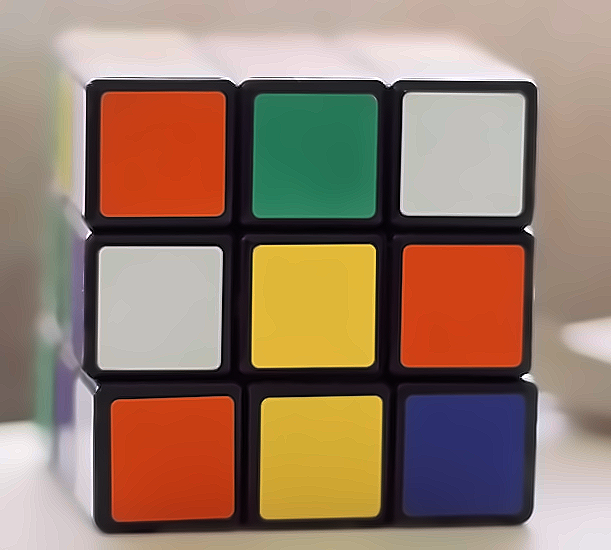
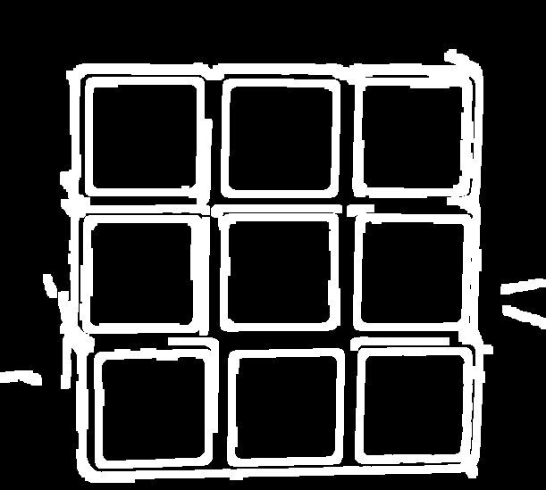
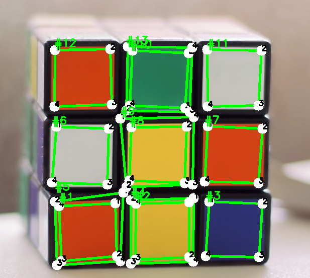

[Retour à l'index](../../readme.md)
>Auteur: Raphaël Roumat

## Reconnaissance visuelle de la configuration du cube

Bibliothèques non standards utilisés:

- `Numpy`: pip install numpy
- `Opencv2`: pip install opencv-python
- `Matplotlib`: pip install matplotlib

Cette partie consiste en la segmentation colorimétrique de photos du rubiks cube (une par face), afin de construire plusieurs groupes de couleurs utilisables par la suite dans une représentation virtuelle du cube.
Les résultats attendus sont donc 6 groupes de couleurs (numérotés de 1 à 6) utilisables par [l'algorithme de résolution](../algorithm_solve/algorithm_solve.md).

Pour obtenir ce résultat nous passons par 5 grandes étapes:

- Préparation de l'image
- Détection des carrés
- Tri des carrés et correction des coordonnées
- Extraction des couleurs
- Création des groupes de couleurs

### Préparation de l'image

La détection de formes nécessite certains ajustements afin d'obtenir des résultats rapides et pertinents.

Tout d'abord afin de réduire le temps de calcul les images trop grandes sont redimensionnées, puis on applique un filtre médian et on augmente la netteté avec un **noyau d'amélioration de netteté** pour rendre les bords plus faciles à détecter.

Noyau de netteté utilisé:

> |   0    |   -1   |   0    |
> | :----: | :----: | :----: |
> | **-1** | **5**  | **-1** |
> | **0**  | **-1** | **0**  |

Le résultat obtenu est ensuite utilisé par l'algorithme de détection de contours de **Canny**.

|           Image de départ           |          Bords détectés          |
| :---------------------------------: | :------------------------------: |
|  |  |

Pour fermer d'éventuels carrés ouverts les bords subissent une dilatation à l'aide d'un **noyau morphique**.

Noyau morphique utilisé:

> |   1   |   1   |   1   |   1   |   1   |
> | :---: | :---: | :---: | :---: | :---: |
> | **1** | **1** | **1** | **1** | **1** |
> | **1** | **1** | **1** | **1** | **1** |
> | **1** | **1** | **1** | **1** | **1** |
> | **1** | **1** | **1** | **1** | **1** |

|          Image de départ          |              Bords dilatés               |
| :-------------------------------: | :--------------------------------------: |
|  |  |

### Détection des carrés

Une fois les contours correctement détectés, ils sont ensuite utilisés par l'algorithme de Ramer–Douglas–Peucker afin de déterminer directement les carrés de couleur.
Les formes détectées sont filtrées par leur nombre de côté et le ratio largeur/longueur.

|              Image de départ              | Représentation des carrés détectés  |
| :---------------------------------------: | :---------------------------------: |
|  |  |

### Tri des carrés et correction des coordonnées

On observe certains carrés incorrects et d'autres se superposant.

Pour régler le problème on supprime les carrés ayant des carrés à l'intérieur d'eux-mêmes.

|           Image de départ            |           Carrés corrigés            |
| :----------------------------------: | :----------------------------------: |
|  |  |

### Extraction des couleurs

Pour associer un groupe de couleur à un carré d'une face il faut lui associer une couleur. Pour trouver ces résultats on extrait la valeur RGB de chaque pixel dans un carré et on effectue la moyenne de la couleur du carré.

On obtient donc 9 couleurs RGB par face:

```
[161, 58, 66]
[160, 54, 63]
[44, 150, 82]
[203, 173, 80]
[211, 99, 74]
[209, 94, 72]
[185, 200, 216]
[199, 168, 73]
[202, 90, 68]
```

### Création des groupes de couleurs

Une fois les couleurs moyennes obtenues sur les 6 faces du Rubik's Cube on peut utiliser différentes conditions pour simplifier le groupage des couleurs:

- 6 groupes car 6 faces
- 9 membres par groupe car 9 carrés par face
- 2 membres d'un même groupe sont proches dans l'espace RGB

|Représentation des couleurs d'un cube dans l'espace RGB|
:----------------------------------------:


Pour la création des groupes on utilise un algorithme de fusion du point le plus proche. On compte le nombre de points dans ceux fusionnés et dès que l'on atteint une taille de 9 on retire le point de la liste des points fusionnables. On répète l'opération jusqu'à ne plus avoir de point fusionnable.
