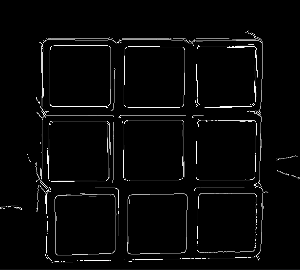

# Projet Tutoré 3: Robot Rubik's Cube

>**Etudiants**: Raphaël Roumat, Clement Gehin, Loic Abel, Loris Dematini
>
>**Tuteur**: Pierre-Frederic Villard

## Reconnaissance de la configuration du cube


Bibliothèques non standards utilisés:
- `Numpy`: pip install numpy
- `Opencv2`: pip install opencv-python
- `Matplotlib`: pip install matplotlib

Cette partie consiste en la construction de groupes de couleurs depuis les photos des 6 faces du Rubik's Cube.
Le résultat attendu est donc 6 groupes de couleurs (numérotés de 1 à 6) utilisables par l'algorithme de résolution.

Pour obtenir ce résultat nous passons par 5 grandes étapes:
- Préparation de l'image
- Détection des carrés
- Trie des carrés et correction des coordonnées
- Extraction des couleurs
- Création des groupes de couleurs

### Préparation de l'image

La détection de forme nécessite certains ajustements pour obtenir des résultats rapides et de qualités.

Tout d'abord afin de réduire le temps de calcul les images trop grandes sont redimensionnées.
Ensuite afin de rendre les bords plus faciles à détecter on applique un filtre médian et on augmente la netteté avec un **noyau d'amélioration de netteté**.

Noyau de netteté utilisé:
>
>|0|-1|0|
>:---:|:---:|:---:
>**-1**|**5**|**-1**
>**0**|**-1**|**0**

Le résultat obtenu est ensuite utilisé par l'algorithme de détection de contours de **Canny**.

Image de départ           |  Bords détectés
:-------------------------:|:-------------------------:
  |  

 Pour fermer d'éventuels carrés ouverts les bords subissent une dilatation à l'aide d'un **noyau morphique**.

 Noyau morphique utilisé:
>
>|1|1|1|1|1|
>:---:|:---:|:---:|:---:|:---:
>**1**|**1**|**1**|**1**|**1**
>**1**|**1**|**1**|**1**|**1**
>**1**|**1**|**1**|**1**|**1**
>**1**|**1**|**1**|**1**|**1**

Image de départ           |  Bords dilatés
:-------------------------:|:-------------------------:
  |  


### Détection des carrés

La détection des carrés fonctionne avec la détection des contours sur l'image préparée. Les contours sont ensuite utilisés par l'algorithme de Ramer–Douglas–Peucker.
Les formes détectées sont filtrées par leur nombre de côté et le ratio largeur/longueur.

Image de départ           |  Représentation des carrés détectés
:-------------------------:|:-------------------------:
  |  

On observe que certains carrés ne sont pas bons et que certains carrés sont détectés par-dessus d'autres carrés.

Pour régler le problème on supprime les carrés ayant des carrés à l'intérieur d'eux-mêmes.


### Trie des carrés et correction des coordonnées

On observe que certains carrés ne sont pas bons et que certains carrés sont détectés par-dessus d'autres carrés.

Pour régler le problème on supprime les carrés ayant des carrés à l'intérieur d'eux-mêmes.

Image de départ           |  Carrés corrigés
:-------------------------:|:-------------------------:
  |  

### Extraction des couleurs

Pour associer un groupe de couleur à un carré d'une face il faut lui associer une couleur. Pour réaliser ce résultat on extrait la valeur RGB de chaque pixel dans un carré et on réalise la moyenne de la couleur du carré.

Le résultat pour une face est donc 9 couleurs:
```
[161, 58, 66]
[160, 54, 63]
[44, 150, 82]
[203, 173, 80]
[211, 99, 74]
[209, 94, 72]
[185, 200, 216]
[199, 168, 73]
[202, 90, 68]
```

### Création des groupes de couleurs

Une fois les couleurs moyennes obtenues sur les 6 faces du Rubik's Cube on peut utiliser différentes conditions pour simplifier le groupage des couleurs:
- 6 groupes car 6 faces
- 9 membres par groupe car 9 carrés par face
- 2 membres d'un même groupe sont proches dans l'espace RGB

|Représentation des couleurs d'un cube dans l'espace RGB|
:----------------------------------------:


Pour la création des groupes on utilise un algorithme de fusion du plus proche point. On compte le nombre de points dans les points fusionnés et dès que l'on atteint une taille de 9 on retire le point de la liste des points fusionnables. On répète l'opération jusqu'à ne plus avoir de point fusionnable.